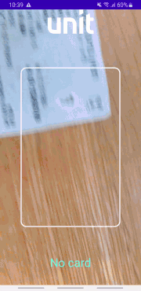
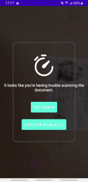
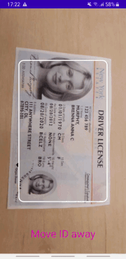
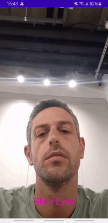
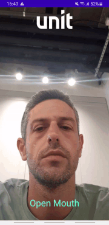

# Vocuhed SDK for Android


## Introduction
Vouched is an identity verification platform powered by artificial intelligence. It is completely automated and requires no extra human intervention for verifications. The process is simple. Using our tech, have your users take a picture of their ID and themselves, send them to us, and Vouched will verify the authenticity of their identity.
<br/>
This is a helper guide that intends to clarify the process of implementing the [Vouched SDK for Android](https://github.com/vouched/vouched-android). 


## Prerequisites
   - A Vouched Public Key 
   - Clone and run the [Vouched Example app](https://github.com/vouched/vouched-android).
     
      - Follow the steps listed on the [example README](https://github.com/vouched/vouched-android/blob/master/examplekt/README.md).
   - Read the [overview for the SDK components](https://github.com/vouched/vouched-android/blob/master/SDKOverview.md).
   
   - Read the documentation for the [Unit Vouched Sample App](./app/README.md).

   - Clone and run this repo.
     - Verify that you entered a Vouched Public Key as specified in [Unit Vouched Sample App documentation](./app/README.md).
     
   - When reading this guide, refer to the files in the UnitVouchedSampleApp to understand how to implement the simplified code examples described in the Integration steps below into practice.

## Integrate Vouched SDK into your app 

- Follow the `Install` section in the [Vouched for Android guide](https://github.com/vouched/vouched-android#install) and add the relevant packages.
- At your module's `build.gradle` file set the minSdk to at least 22.

#### Permissions
Add to your `AndroidManifest.xml` file the following permissions above the `<application` tag:
```kotlin
<uses-permission android:name="android.permission.CAMERA" />
<uses-permission android:name="android.permission.INTERNET" />
```
The `UNVouchedServicePermissionExt.kt` file shows how these permissions are requested of the user.

Optional: Add to your `AndroidManifest.xml` file the following features above the `<application` tag so that Play Store will filter your app for incompatible devices(for example: devices without camera)

```kotlin
<uses-feature android:name="android.hardware.camera" />
<uses-feature android:name="android.hardware.camera.autofocus" />
<uses-feature
android:glEsVersion="0x00020000"
android:required="true" />
```

## Integration steps

### Vocuhed SDK flow

A flow consists of capturing an id, a selfie and then see Vouched results based on the captured images. Add all the following code sections to the file in which you intend to integrate the Vouched SDK. You can find an example of a class that integrates with Vouched SDK in UnitVouchedSampleApp in the `UNVouchedService` class file.


### VouchedSession
This class handles a user's Vouched session. It takes care of the API calls. Use one instance for each flow.
We will post captured images and extract the final results using this session.

#### Initialize
```kotlin
private var session: VouchedSession? = VouchedSession("PUBLIC_KEY")
```


### VouchedCameraHelper
This class is introduced to make it easier for developers to integrate VouchedSDK and provide the optimal photography. The helper takes care of configuring the capture session, input, and output. Helper has following detection modes: 'ID' | 'FACE' | 'BARCODE' | 'ID_BACK'.

#### Configure
You can initialize the helper by specifying a Detector that you wish to use. 
We'll use the method 
`fun configureHelper(mode: VouchedCameraHelper.Mode)`
to simplify the configuration of the helper. To use the helper you will need to create a View that will hold the captures. we chose to use the `PreviewView` which is a custom view that displays the camera feed for CameraX's Preview use case, making the capturing container white-labeled, e.g. the user will not know he is using the Vouched SDK and you may brand the screen as you like:


<details>
   
   <summary>An illustration of a white-labeled ID capture (we picked the logo, the text, the rectangle shaped frame and the "continue" button).</summary>
   

   
</details>

```android
val previewView: PreviewView
```

Call the `configureHelper` function in the `onCreate` function of your `Activity`:
```kotlin
private var mode = VouchedCameraHelper.Mode.ID

override fun onCreate(savedInstanceState: Bundle?) {
    configureHelper(mode)
}
```

The difference between capturing different modes can be found in the `VouchedCameraHelperOptions` value. There, you'll also be able to choose your liveness checks. To better understand the different types of configurations for the `VouchedCameraHelperOptions` check the [Vouched references](https://github.com/vouched/vouched-android#initialize), and the [CardDetectOptions](https://github.com/vouched/vouched-android#carddetectoptions) for cards and [FaceDetectOptions](https://github.com/vouched/vouched-android#facedetectoptions) for face detections.

```kotlin

private lateinit var cameraHelper: VouchedCameraHelper

fun configureHelper(mode: VouchedCameraHelper.Mode) {
    try {
        var detectOptions: VouchedCameraHelperOptions? = null
        when (mode) {
            VouchedCameraHelper.Mode.ID -> {
                detectOptions = detectionOptionsForId()
            }
            VouchedCameraHelper.Mode.FACE -> {
                detectOptions = detectionOptionsForFace()
            }
            else -> {}
        }
        cameraHelper = VouchedCameraHelper(
            this.context,
            this.context as LifecycleOwner,
            ContextCompat.getMainExecutor(this.context),
            previewView,
            mode,
            detectOptions
        )
    } catch (e: VouchedAssetsMissingException) {
        e.printStackTrace()
    }
}
```

Example implementation for the `VouchedCameraHelperOptions` for a card:

<details>
   
   <summary>With a timeout option and a custom view we created, and a manual capture. For implementation details check the `UNVouchedService` file in the UnitVouchedSampleApp </summary>
   

   
</details>

<details>
   
   <summary>With a distance check</summary>
   

   
</details>

```kotlin
private fun detectionOptionsForId(): VouchedCameraHelperOptions {
    return VouchedCameraHelperOptions.Builder()
        .withCardDetectOptions(
            CardDetectOptions.Builder()
                .withEnableDistanceCheck(true)
                .withEnhanceInfoExtraction(false)
                .withEnableOrientationCheck(false)
                .build()
        )
        .withCardDetectResultListener(this)
        .withBarcodeDetectResultListener(this)
        .withCameraFlashDisabled(true)
        .withTimeOut(20000, this::handleTimeOut)
        .build()
}
```

Example implementation for the `VouchedCameraHelperOptions` for face:

<details>
   
   <summary> Example for a blinking movement liveness check </summary>
   

   
</details>

<details>
   
   <summary> Example for a distance movement liveness check </summary>
   

   
</details>

<details>
   
   <summary> Example for a mouth movement liveness check </summary>
   

   
</details>

```kotlin
private fun detectionOptionsForFace(): VouchedCameraHelperOptions {
    return VouchedCameraHelperOptions.Builder()
        .withFaceDetectOptions(
            FaceDetectOptions.Builder()
                .withLivenessMode(LivenessMode.NONE)
                .build()
        )
        .withFaceDetectResultListener(this)
        .build()
}
```

#### Start Capture
In order to start the capturing, add the following code to your `Activity` in the `onResume` function:
```kotlin
override fun onResume() {
    super.onResume()
    // First check for permissions
    try {
        cameraHelper.onResume()
    } catch (e: VouchedCameraHelperException) {
        e.printStackTrace()
    }
}
```
In order to pause the capturing, add the following code to your `Activity` in the `onPause` function:
```kotlin
override fun onPause() {
    super.onPause()
    cameraHelper.onPause()
}
```

#### Handle the results that were captured by the helper
##### Step 1- implement the intefaces
To handle the results your class should implement the following interfaces: `CardDetect.OnDetectResultListener`, `OnBarcodeResultListener`, `FaceDetect.OnDetectResultListener`. In the next few steps we'll see how.
```kotlin
class YourClass :
    CardDetect.OnDetectResultListener,
    OnBarcodeResultListener,
    FaceDetect.OnDetectResultListener {

    override fun onCardDetectResult(cardDetectResult: CardDetectResult?) {
        ...
    }

    override fun onFaceDetectResult(faceDetectResult: FaceDetectResult?) {
        ...
    }

    override fun onBarcodeResult(barcodeResult: BarcodeResult?) {
        ...
    }
}
```

##### Step 2 - Post a postable capture
When the result.step is .postable you can stop capturing and create a Vouched Job by posting the capture using the session. A Vouched Job is Vouched response which contains the job id, results, errors and signals that have been generated during that stage of the verification flow.

```kotlin
override fun onCardDetectResult(cardDetectResult: CardDetectResult?) {
    when (cardDetectResult?.step) {
        Step.POSTABLE -> {
            onPause()
            session?.postFrontId(this.context, cardDetectResult, Params.Builder(), this)
        }
        else -> {
            // Get Instruction from Vouched (will be explained in the next step)
            val instruction = cardDetectResult?.instruction
            // Update the user with the instruction
        }
    }

override fun onFaceDetectResult(faceDetectResult: FaceDetectResult?) {
    when (faceDetectResult?.step) {
        Step.POSTABLE -> {
            onPause()
            session?.postFace(this.context, faceDetectResult, null, this)
        }
        else -> {
            // Get Instruction from Vouched (will be explained in the next step)
            val instruction = faceDetectResult?.instruction
            // Update the user with the instruction
        }
    }
}

override fun onBarcodeResult(barcodeResult: BarcodeResult?) {
    if (barcodeResult != null) {
        // Does not have instructions
        onPause()
        session?.postBackId(this.context, barcodeResult, Params.Builder(), this)
    }
}
```

Vouched SDK offers the option to send a user-captured image for ID rather than a CardDetectResult. For additional information, take a look at the method `fun postId(manualCaptureImage: Bitmap)` in `UNVouchedService`.

If you want to learn more about the job response fields go the [Vouched API reference](https://docs.vouched.id/reference/submitjob-1) -> RESPONSES -> and select 200.


More fields are available at the Vouched API reference link.


##### Step 3- Use Vouched SDK detection Instructions
Relevant instructions are obtained from the capture that was captured when it isn't a postable capture. The instructions will guide the user through the Liveness detection and will also guide the photo capture in order to make it postable. You can create custom messages to display to the user based on the result.instruction that Vouched returned using an Enum or a custom function(check the UnitVouchSampleApp's `DescriptiveTextExt.kt` file)

<details>
   
   <summary>An illustration of receiving instructions and presenting the user with personalized messages (in green) based on them</summary>
   

   
</details>


```kotlin
// Accesses an instruction
result.instruction
```
Possible instructions are:
```kotlin
public enum Instruction {
    NO_CARD,
    ONLY_ONE,
    MOVE_CLOSER,
    MOVE_AWAY,
    ROTATE_TO_HORIZONTAL,
    ROTATE_TO_VERTICAL,
    GLARE,
    DARK,
    BLUR,
    HOLD_STEADY,
    NO_FACE,
    OPEN_MOUTH,
    CLOSE_MOUTH,
    LOOK_FORWARD,
    LOOK_LEFT,
    LOOK_RIGHT,
    BLINK_EYES,
    NONE;
}
```

##### Step 4- On job response
After posting a capture using the `session`, your class needs to implement the following interface in order to receive a response from Vouched:
 `VouchedSession.OnJobResponseListener`, and access `response.job`:
```kotlin
class YourClass : ...
    , VouchedSession.OnJobResponseListener {
    ...
    override fun onJobResponse(response: JobResponse) {
        val job = response.job
        // Extract Vouched Insight
        // This insight will be based on Vouched analysis of the captures (will be explained in the next step).
        val insights = VouchedUtils.extractInsights(response.job)
        if (insights.size != 0) {
            // Get the Insight's Enum constant
            val insight = insights[0]
            // Update the user
        }
    }
}

```

##### Step 5- Use Vouched SDK detection Insights
Insights categorize image analysis output signals for easier identification, which in many cases can provide a means of user guidance or insight with respect to image based issues. You can create custom messages to display to the user based on the `Insight` that Vouched returned using an Enum or a custom function(check the UnitVouchSampleApp's `DescriptiveTextExt.kt` file). Insights are typically extracted from a Job through the use of `VouchedUtils.extractInsights(job: Job)`.


Possible insights are:

```kotlin
public enum Insight {
    UNKNOWN,
    NON_GLARE,
    QUALITY,
    BRIGHTNESS,
    FACE,
    GLASSES,
    ID_PHOTO
}
```


### Finish Capturing
After you used the session to post the captures of your card and face to Vouched and got jobs in return, you should get the verification results, also known as job results. This is an object that Vouched returns that holds it's algorithms score thresholds for the different captures. You can find an example for using the results in the Vouched Example app in `ResultsActivity` file.

```kotlin
session?.confirm(this.context, null) { jobResponse ->
    val job = jobResponse.job
    // handle job results
}
```

If you want to learn more about the job results response fields go the [Vouched API reference](https://docs.vouched.id/reference/submitjob-1) -> RESPONSES -> select 200 -> result 


More fields are available at the Vouched API reference link.


You might be interested in the "confidences" field, which contains a confidence rating for the captures returned by Vouched algorithms (ranging from 0.0 to 1.0).


More fields are available at the Vouched API reference link.


